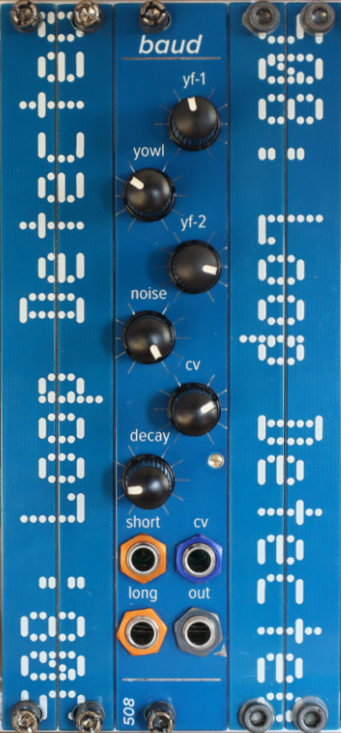

# baud

A 4HP Eurorack percussion module that started out life as a hi-hat and took some inspiration from sounds created by the brilliant Hexinverter Jupiter Storm (I've never seen its schematic, but I think it has PLLs in there somewhere). 

There are essentially two pieces:

- a noise source (volume controlled by the "noise" pot)
- two CD4046 PLL ICs set up to cross-modulate each other, and mixed together (volume controlled by the "yowl" pot)

The frequency of each PLL's VCO is controlled by the "yf-1" and "yf-2" pots, and they're both further controlled simultaneously by the CV input (which normals 5V to the CV pot when nothing is plugged in)

There are two trigger inputs, short and long. Short is pretty short -- think of it like a closed hat. Long has its decay controlled by the "decay" pot.

Just play around with everything until you get a sound you like -- there are MANY hidden in this module.

Trimming is as follows:

- VR1 on the back should be 5V -- there are test points to check this
- VR2 on the back sets the reference voltage for the trigger inputs -- start by not messing with it, and then if you're getting double triggers / flamming, fiddle with it
- VR3 (thru the hole on the front) sets the shortness of the short trigger 

This module, like many of my modules, uses 2mm-pitch male/female headers. Be sure you order/use the right thing!

Most ICs are SOIC 8/14/16; all passives are 0805. The BOMs prefixed with `fixed` are easier to read; the others can be used along with the Pick-and-place and gerber files to order PCBs.

There is a short demo video here: https://youtu.be/sk9AuCy46Ws
